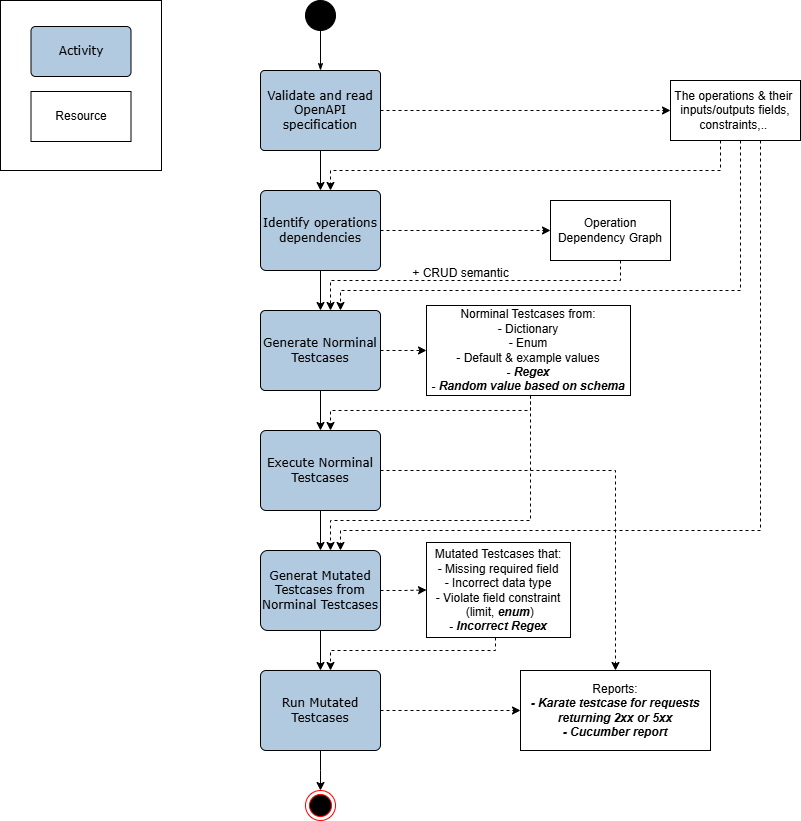

# GenoTeD

## Introduction

Based on the algorithmic idea of the automated testing tool
[RestTestGen](https://ieeexplore.ieee.org/abstract/document/9159077), generating test input data for the API in a sequence of related operations, creating both test cases for normal cases and test cases for error cases. Thereby,
creates a comprehensive testing method with practical applications, solving the need to
write test inputs for APIs quickly and at a low cost.

Not only does it overcome the
limitations of RestTestGen, the proposed tool - GenoTeD also excels in terms of error
finding efficiency and comprehensiveness. In particular, GenoTeD has surpassed the reference solution in terms of bug finding efficiency. This has been demonstrated in the experiment, GenoTeD found 45 more bugs than RestTestGen,
a 26% increase in the total number of bugs found by RestTestGen in 6 different APIs. In addition, the generated data is more user-friendly and closer to reality than
RestTestGen's random data. Moreover, GenoTeD also integrates Karate and Cucumber to generate readable and reusable test cases, along with an intuitive reporting interface, enhancing the usability and practical applicability
of the tool.

## Workflow

The following graph illustrates the workflow of GenoTeD, which mostly based on the design of RestTestGen.
Notably, the bold parts are the improvements compared to RestTestGen.

